<div align="center">

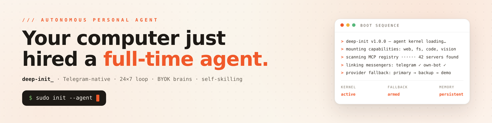

# deep-init_

**Your computer just hired a full-time agent.**
A 24×7 personal autonomous assistant you talk to on **Telegram** — with a full **mission-control web console**.

[](https://nextjs.org)
[](https://react.dev)
[](https://typescriptlang.org)
[](https://tailwindcss.com)
[](https://core.telegram.org/bots/api)
[](https://z.ai)

> 🎁 **Need the Z.AI GLM Coding Plan?** Check this invite token for **10% OFF** → **[z.ai/subscribe?ic=ROK78RJKNW](https://z.ai/subscribe?ic=ROK78RJKNW)**

**[Live demo →](https://deep-init-ai.vercel.app)** · [Quickstart](#-quickstart) · [Screenshots](#-screenshots) · [Architecture](#-architecture)

</div>

---

## ✨ What it does

**Deep-init AI** is a personal autonomous agent platform: run a friendly in-browser wizard, pair a Telegram bot, connect any AI provider (with automatic multi-provider fallback), and your agent goes live — reachable from Telegram around the clock.

| | |
|---|---|
| 🧙 **Friendly 5-step wizard** | Identity → Telegram → AI brains → directives → initialize. Credentials are auto-generated along the way. |
| 🤖 **Telegram, actually wired** | Pair the **built-in bot** (`@init_smart_bot`) with zero setup, or bring your **own @BotFather bot** (token verified live, webhook auto-registered on public origins). Send your Channel Pairing Token (`DIP-XXXX-XXXX`) to the bot → `Paired ✓` → from then on it answers every message through your agent's real brain chain. |
| 🧠 **Any AI provider + automatic fallback** | OpenAI-compatible and Anthropic-native endpoints (OpenAI, Anthropic, OpenRouter, Groq, DeepSeek, Mistral, Gemini, Ollama…). The chain is tried top-down; failures, timeouts and rate-limits fall through mid-task. An **offline reflex tier** catches the last resort — the agent *never goes mute*, even with zero providers and no cloud egress. |
| 🔬 **Hermes & Moltis cognition packs** | Port the minds of the two leading open-source agent projects onto your Init — enable one, both, or neither with a toggle. Hermes brings tool-use enforcement, no-fabrication discipline and parallel calls; Moltis brings its SOUL.md personality, opinionated tone and calc engine. Both ON = hybrid cognition. |
| 🎙 **Voice mode, both ways** | Talk to your agent hands-free in the web console: continuous speech-to-text, replies spoken back with natural neural voices, and the mic auto-reopens after each answer — a real conversation loop. Works in **any browser**: when live recognition isn't available (Firefox, blocked speech servers), it transparently switches to compat capture (mic PCM → keyless server-side transcription). **Telegram voice notes are transcribed too** — speak your messages, get answers. |
| 👥 **Access whitelist** | Mint per-person pairing tokens for friends/teammates and choose per user whether they **share** the agent's memory & context or get an **isolated** private thread. |
| 🔐 **Web portal logins** | The wizard generates a portal username + access token (`di_…`); the console is locked behind them on every visit. |
| 🎛 **Mission-control dashboard** | Live loop feed, agent console, gateway status (bound chats, recent replies, resync, poll bridge), provider health checks, tools/MCP registry, virtual instances (SSH + pair-tunnel), full activity log. |
| 🖥 **Virtual instances & pair tunnel** | Register SSH machines (linux/mac/VPS) and run the generated tunnel script (bash / PowerShell / WSL) so the agent can operate on your machines when its cloud env isn't enough. |
| 📈 **Self-skilling** | The agent ships with `zcode-smart-skill v2` armed and writes its own new skills when a task needs one. |
| 🌍 **EN / RU / עברית** | Full UI translation with automatic RTL flip for Hebrew. |

## 📸 Screenshots

> All screenshots are live captures from the production app — [deep-init-ai.vercel.app](https://deep-init-ai.vercel.app).

### Landing — not a chatbot, a full-time operator

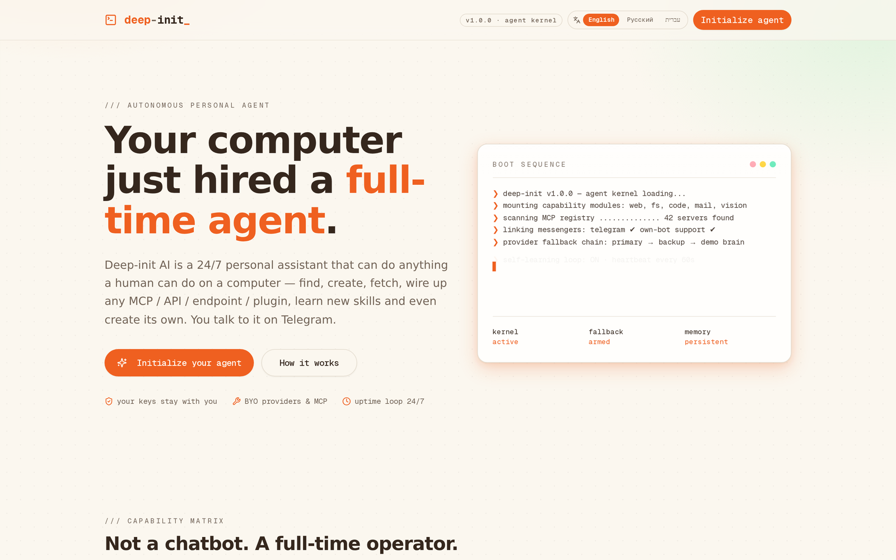

### Five-minute wizard

| Identity | Telegram |
|---|---|
| 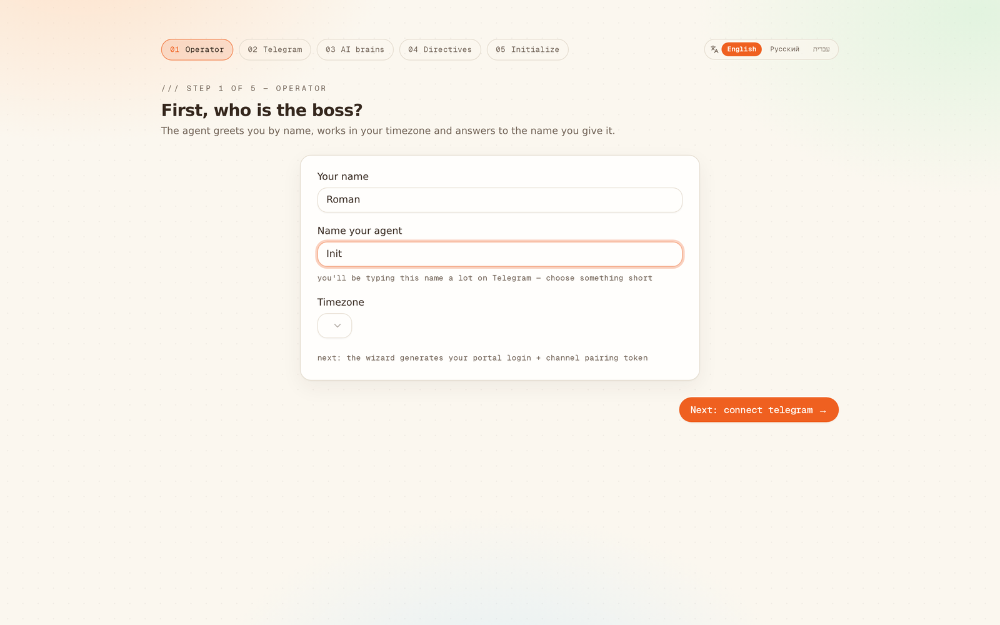 | 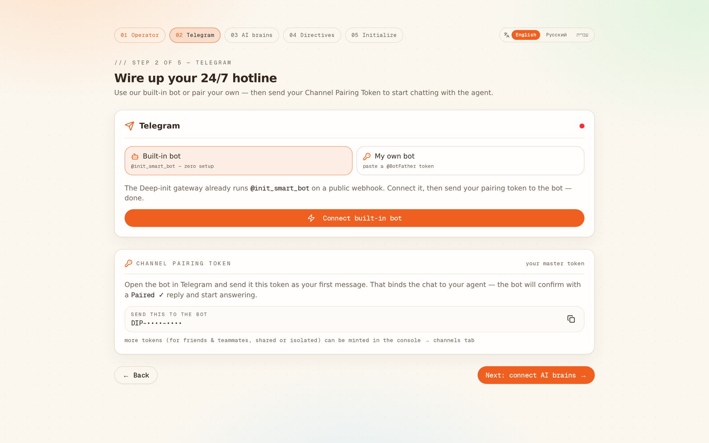 |

| AI brains (BYOK, optional) | Directives |
|---|---|
| 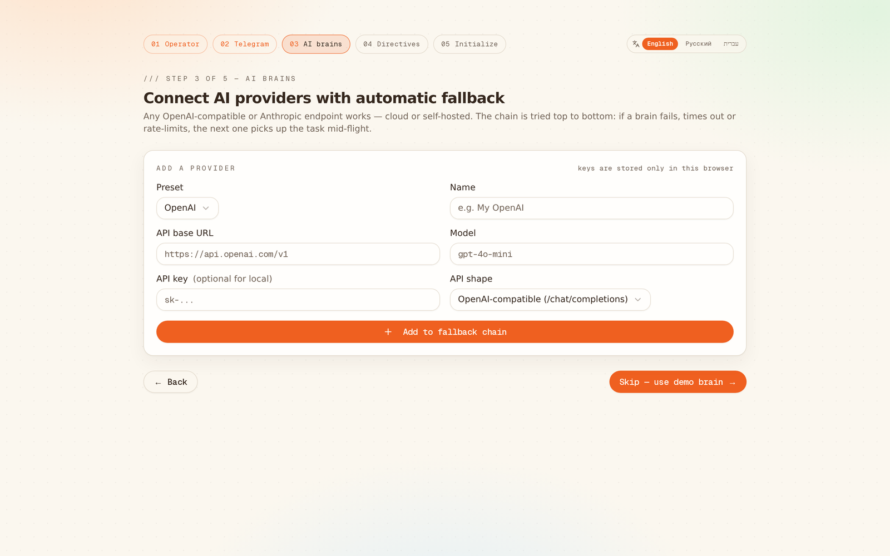 | 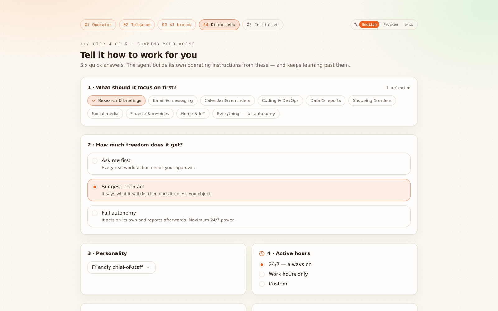 |

Access credentials are generated for you — portal login + channel pairing token:

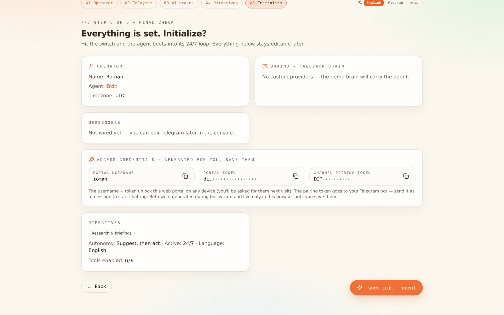

### Mission-control dashboard

Live loop feed, KPI cards, standing orders, portal access, skill registry:

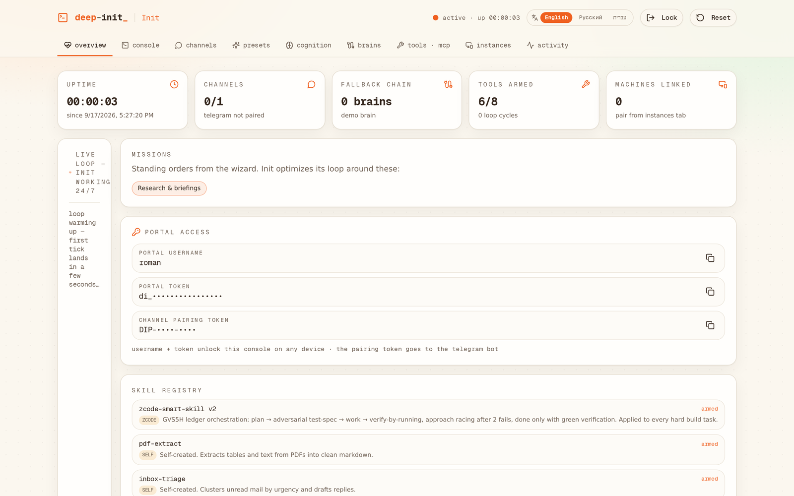

### Cognition packs — Hermes & Moltis, one toggle each

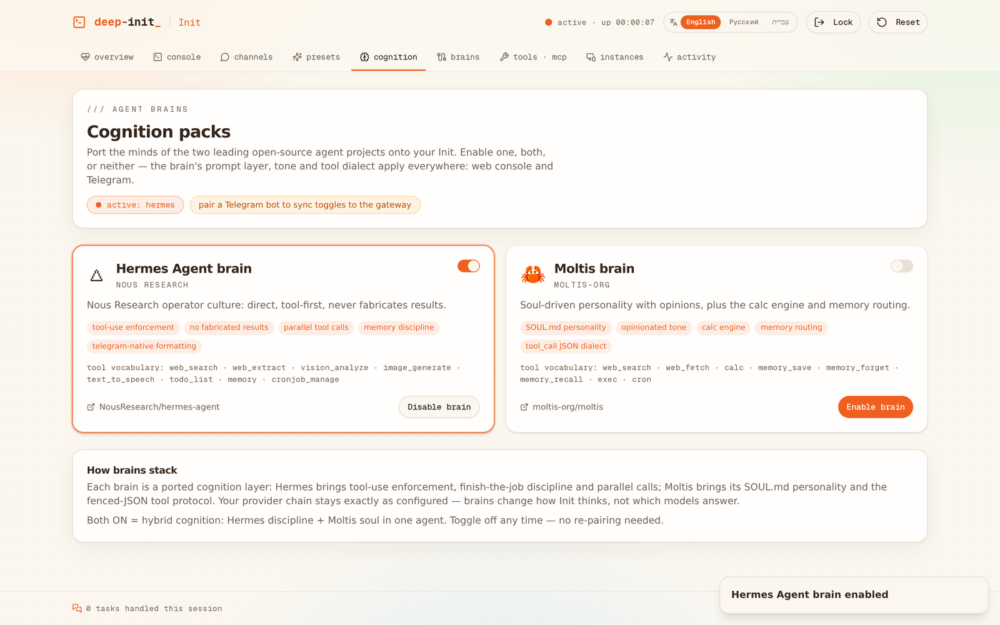

### Agent console & channels

The console answers through the brain chain — and even with zero providers configured, the offline reflex tier still does real work (server-side arithmetic, status, time):

| Console | Channels & whitelist |
|---|---|
| 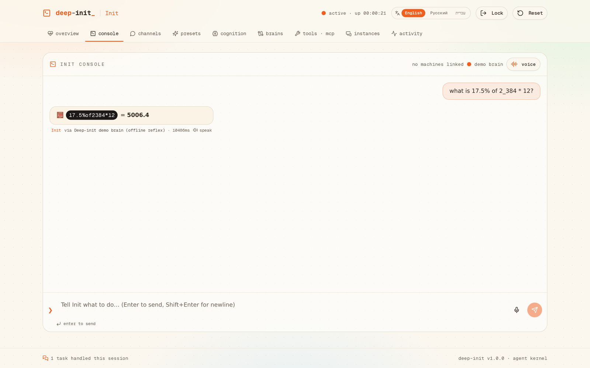 | 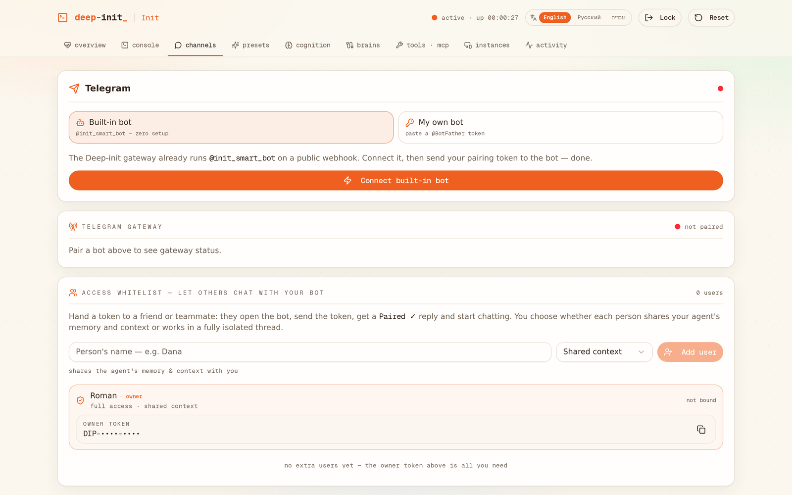 |

Full i18n with Hebrew RTL:

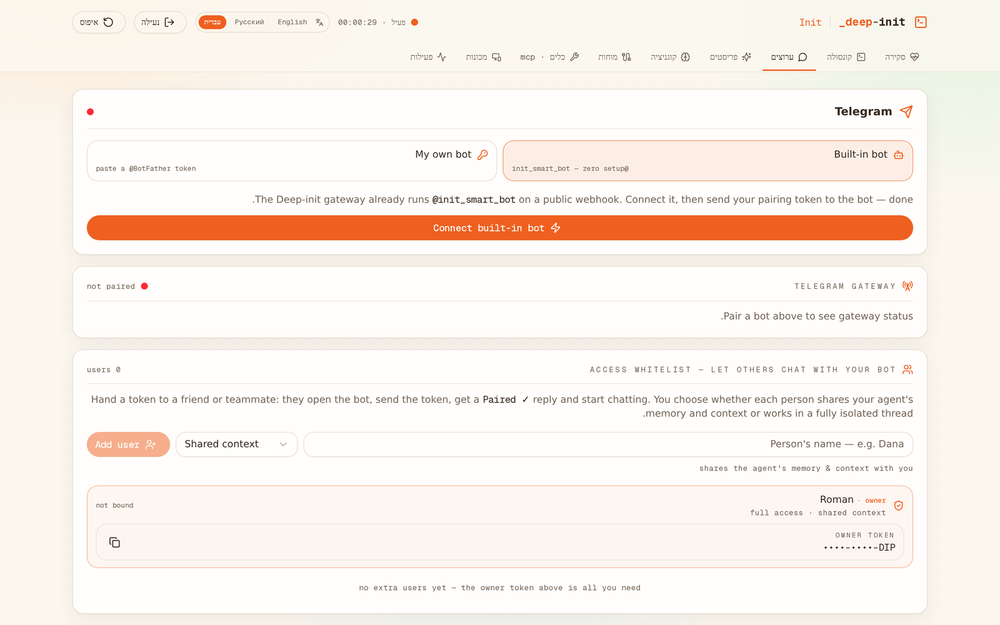

## 🏗 Architecture

```
Browser (Next.js 16, React 19, Tailwind 4, shadcn/ui, zustand+persist)
  ├─ wizard / dashboard / console — BYOK config lives in localStorage
  ├─ /api/chat              → provider fallback chain + cognition packs (server proxy)
  ├─ /api/pair/telegram     → token verify (getMe) + agent registration + webhook/poll decision
  ├─ /api/telegram/webhook  → Telegram push  → gateway handler
  ├─ /api/telegram/poll     → browser-driven getUpdates bridge (localhost / webhook-less)
  ├─ /api/telegram/status   → bound chats, bound tokens, recent replies
  ├─ /api/instances/*       → SSH virtual instances
  ├─ /api/tunnel/*          → pair-tunnel registration, check-in, commands, scripts
  └─ /api/voice/tts         → neural voice
```

**Gateway registry** (`src/lib/agent-registry.ts`) keeps per-agent runtime config (bot token, system prompt, provider chain, whitelist, bound chats, threads):

- **production** — Vercel Blob (`gateway/registry.json`, private store, `useCache: false` reads + merge-before-write) so the state is shared across lambda instances. Registry TTL is 24 h of inactivity; the dashboard auto-resyncs its config, healing cold starts.
- **dev** — JSON file under `.gateway/` so state is shared across Next.js worker processes.

**Pairing flow** — `findByPairingToken` matches an incoming `DIP-…` message against owner + whitelist tokens of every agent on that bot, binds the chat (`owner` / `shared` / `isolated` mode), then serves every further message from the matched thread with a per-user context line injected into the system prompt.

**Tool-call defense** — agent-flavored models sometimes emit raw tool-call syntax *as text* (`<function=…>`, `<invoke…>`). Deep-init parses those blocks out of the stream, **actually executes** supported tools server-side (web search, page reading, arithmetic…), feeds results back into the loop, and sanitizes every output — no leaked syntax, no fabricated results, ever.

## 🚀 Quickstart

```bash
npm install
npm run dev        # http://localhost:3000
```

1. Click **Initialize your agent**, fill in your name + agent name.
2. Choose **Built-in bot** or paste your own @BotFather token.
3. Add AI providers (or skip — the offline reflex tier carries it).
4. Answer the directives questions, review your **access credentials**, hit `sudo init --agent`.
5. Send your Channel Pairing Token to the bot in Telegram → start chatting.

### Environment

| Variable | Required | Purpose |
|---|---|---|
| `BUILTIN_TELEGRAM_BOT_TOKEN` | no* | Token of the shared built-in bot (`@init_smart_bot`). A default is compiled in for convenience — override with your own for any serious deployment. |
| `ZAI_API_KEY` / `ZAI_BASE_URL` | no | Optional cloud demo tier. When present, the serverless-safe `getZAI()` helper materializes the SDK config at runtime; without it the offline reflex tier answers instead. |
| `DATABASE_URL` | no | Scaffold default; the app is client-storage-first and doesn't need a DB. |

\* The bundled built-in token is public by design (it is the product's shared bot) — anyone can pair to it with their own unguessable `DIP-…` token. For private deployments, create your own bot and set the env var.

### Localhost vs production gateways

| Origin | Update transport | Notes |
|---|---|---|
| localhost | **poll bridge** (browser pings `/api/telegram/poll` every 4 s while the portal is open) | Telegram can't reach localhost; webhook is cleared so `getUpdates` works. Toggle "Run poll bridge" in Channels. |
| public (Vercel etc.) | **webhook** (`/api/telegram/webhook?t=…`) | Registered automatically at pair time; true 24/7 push. |

If the bot ever goes quiet after a server restart, hit **Resync gateway** in the Channels tab.

## ☁️ Deploy

```bash
npm i -g vercel
vercel link
vercel env add BUILTIN_TELEGRAM_BOT_TOKEN production   # optional
vercel --prod
```

> Tip: keep the repo lean for deploys — `.vercelignore` already excludes `research/`, `docs/` and `scripts/` from the upload.

## 🔐 Security notes

- **BYOK**: provider API keys live only in your browser's `localStorage` — they reach the server only in-flight to proxy a request.
- The web console is gated by your wizard-generated username + token (session-scoped).
- Pairing tokens are 8 chars from an unambiguous 23-char alphabet (~1.8 × 10¹¹ keyspace), single-purpose and revocable from the whitelist panel.
- Live credentials never appear in docs — screenshots ship with masked tokens (`di_••••…`, `DIP-••••-••••`).

## 🧰 Tech

Next.js 16 · React 19 · TypeScript · Tailwind CSS 4 · shadcn/ui · zustand · z-ai-web-dev-sdk (demo tier) · Telegram Bot API · Vercel Blob

---

**Made using GLM 5.3 FLASH** · By **Roman** | [www.rommark.dev](https://www.rommark.dev)
